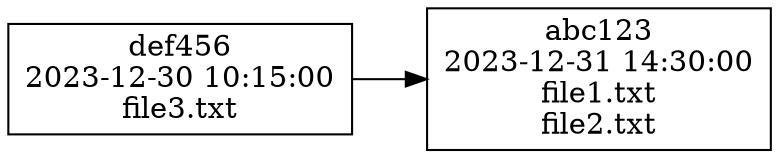

# Домашнее задание №2 по дисциплине "Конфигурационное управление"

## Задание 2. Вариант 3

---

Разработать инструмент командной строки для визуализации 
графа зависимостей, включая транзитивные зависимости. 
Сторонние программы или библиотеки для получения зависимостей 
использовать нельзя.

Зависимости определяются для git-репозитория. Для описания графа 
зависимостей используется представление Graphviz. Визуализатор 
должен выводить результат на экран в виде кода.
Построить граф зависимостей для коммитов, в узлах которого 
находятся списки файлов и папок. Граф необходимо строить
только для коммитов ранее заданной даты.

Ключами командной строки задаются:
* Путь к программе для визуализации графов.
* Путь к анализируемому репозиторию.
* Путь к файлу-результату в виде кода.
* Дата коммитов в репозитории.

Все функции визуализатора зависимостей должны быть покрыты тестами.

---

## Dependency Visualizer  

**Dependency Visualizer** — инструмент командной строки для визуализации графа зависимостей коммитов в Git-репозитории. Граф строится для коммитов, сделанных до указанной даты, с узлами, содержащими информацию о списках файлов и папок.  

Результат визуализации сохраняется в формате Graphviz (DOT), который можно использовать для дальнейшей генерации изображений с помощью сторонних программ, таких как `dot`.

---

## Установка  

1. Убедитесь, что на вашем компьютере установлен Python 3.8+.
2. Склонируйте репозиторий проекта:  
   ```bash
   git clone <URL_РЕПОЗИТОРИЯ>
   cd dependency-visualizer
   ```
3. Установите необходимые зависимости:  
   ```bash
   pip install -r requirements.txt
   ```

---

## Использование  

### Формат команды  
```bash
python dependency_visualizer.py \
    --visualizer-path <путь_к_программе_визуализации> \
    --repo-path <путь_к_репозиторию> \
    --output-path <путь_к_выходному_файлу> \
    --date <дата>
```

### Аргументы  
- **`--visualizer-path`**  
  Путь к программе для визуализации графов (например, `dot`, часть пакета Graphviz).  
  *Пример:* `/usr/bin/dot`  

- **`--repo-path`**  
  Путь к анализируемому Git-репозиторию.  
  *Пример:* `/home/user/my-repo`  

- **`--output-path`**  
  Путь к выходному файлу, где будет сохранен результат в формате DOT.  
  *Пример:* `output_graph.dot`  

- **`--date`**  
  Дата, до которой нужно учитывать коммиты. Формат: `YYYY-MM-DD`.  
  *Пример:* `2024-01-01`  

---

## Примеры  

### Построение графа  
```bash
python dependency_visualizer.py \
    --visualizer-path /usr/bin/dot \
    --repo-path /home/user/my-repo \
    --output-path output_graph.dot \
    --date 2024-01-01
```

### Визуализация графа  
После генерации графа в формате DOT, вы можете использовать `dot` для создания изображения:  
```bash
dot -Tpng output_graph.dot -o output_graph.png
```

---

## Пример вывода  

Пример выходного файла `output_graph.dot` для нескольких коммитов:  


---

## Тестирование  

Проект включает тесты для всех основных функций. Для запуска тестов выполните:  
```bash
python -m unittest
```

---

## Зависимости  

- **Python 3.8+**  
- **Graphviz** — для визуализации графов (опционально, для преобразования формата DOT в изображение).  

---

## Лицензия  

Этот проект распространяется под лицензией MIT. См. файл [LICENSE](LICENSE) для подробностей.